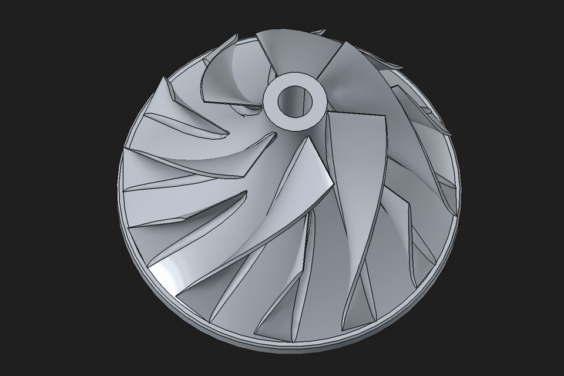
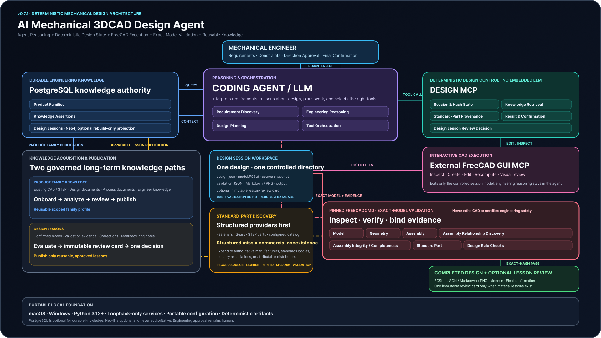

# CAD Agent



CAD Agent helps coding agents turn mechanical
requirements into validated FreeCAD models. It combines requirement reasoning,
knowledge reuse, standard-part provenance, deterministic CAD state, automatic
validation, correction, final confirmation, and reusable Design Lessons.

Nothing here guesses a number. Sizing follows published standards, the result
carries its own assumptions and limitations, and a finished model is confirmed
by a process the agent cannot reach or forge.

The package provides the `mech-cad-design` CLI and
`mech-cad-design-mcp` server. A compatible coding agent performs the design
reasoning, while an external FreeCAD GUI MCP performs interactive CAD work. The
package does not embed a language model and does not replace engineering review.

## Design process

```text
User request
  → requirement clarification
  → short design proposal
  → one natural-language direction approval
  → knowledge retrieval
  → CAD modeling
  → automatic validation and correction
  → correction capture
  → final result
  → natural-language final confirmation
  → automatic Design Lesson evaluation
  → finish, or one decision before durable lesson publication
```

## Core capabilities

- Create new designs or edit read-only snapshots of existing FCStd/STEP models.
- Retrieve matching Product Family Knowledge and Design Lessons when available.
- Continue CAD work when knowledge has no match or its backend is unavailable.
- Model interactively in FreeCAD and keep FCStd as the source of truth.
- Size a spur gear drive from duty inputs (power, speeds, material, duty,
  life, safety factor) through ratio, module, forces, bending and contact
  stress, shaft diameter, and required bearing capacity, then model and
  validate the resulting pair against the same calculated values. Preliminary
  sizing evidence, not a strength certification; see its `limitations`.
- Find purchasable standard parts through configured structured providers and,
  when they miss, extend the search to authoritative manufacturer, standards
  body, industry association, and attributable authorized-distributor sources.
- Register selected CAD components with provider, manufacturer, part identity,
  source, license, validation evidence, and SHA-256 provenance.
- Calculate from Shigley's Mechanical Engineering Design independently of any
  one component: stress states and principal stresses, static and fatigue
  failure criteria, deflection and columns, shafts, bolted joints, springs,
  rolling and journal bearings, gears, welds, clutches, brakes and belts. Pure
  standard library, with every shipped constant checked against an independent
  anchor and every curve fit marked as one.
- Validate geometry, dimensions, placements, interfaces, assemblies,
  fasteners, BOM consistency, and visual evidence.
- Bind completion to the exact FCStd SHA-256 and passed JSON, Markdown, and PNG
  evidence.
- Re-verify the finished model in a separate process the agent does not
  control, under a SHA-256-pinned FreeCAD executable running digest-pinned
  scripts, and accept the result only when a host-issued nonce and the recorded
  model digest both come back unchanged. The agent writes its own validation
  report; this is the part of the evidence it cannot author.
- Record every validation attempt in an append-only correction ledger, so a
  failure that was fixed is not lost when the next attempt is recorded.
- Evaluate reusable lessons automatically after the user confirms the final
  model, including lessons derived from the mandatory checks this design failed
  and then corrected.
- Feed published correction lessons back through ordinary knowledge retrieval,
  so a later design finds the defect before repeating it.
- Store long-term Product Family profiles, Knowledge Assertions, and Design
  Lessons in a local SQLite database by default, with optional PostgreSQL for
  shared team use and an optional rebuild-only Neo4j projection.

## MCP surfaces

The default `design` surface contains the complete design flow:

- `design_system_status`
- `design_start`
- `design_status`
- `design_knowledge_retrieve`
- `design_record_result`
- `design_mistakes`
- `design_gear_size`
- `design_confirm`
- `design_lesson_decide`
- `standard_part_providers_get`
- `standard_part_sources_status`
- `standard_part_download_register`

The separate `knowledge-admin` surface manages Product Family onboarding,
knowledge search, Design Lesson supersession or revocation, and explicit
Neo4j projection rebuilds.

## Architecture



Design sessions live under `designs/<design-id>/` as atomic JSON state, one
authoritative `model.FCStd`, optional source snapshots, validation evidence,
outputs, and an optional lesson review card. CAD creation and validation do not
depend on PostgreSQL.

The knowledge store holds only durable Product Families, Knowledge Assertions,
and Design Lessons, in local SQLite by default or PostgreSQL when configured.
Neo4j is optional, rebuildable, and never authoritative. See
[Architecture and trust boundaries](docs/ARCHITECTURE.md).

## Learning from corrected mistakes

Every call to `design_record_result` appends one entry to the design's
append-only correction ledger: the model hash, the validation outcome, and each
failed check. Nothing in a later attempt rewrites an earlier one, so the record
of what went wrong survives the fix.

When the user confirms the final model, the package groups the mandatory checks
that failed on earlier attempts and passed on the confirmed model. Each such
defect becomes one deterministic Design Lesson candidate carrying
`origin: validation_correction`, its check signature, and how many attempts it
cost. These candidates join any the agent proposes on the same immutable review
card and follow the same single publication decision.

Derivation runs without a language model and never blocks: a design that made
no mistakes derives nothing, an advisory-only failure derives nothing, and a
malformed derivation is dropped rather than holding up a completed model. Once
published, correction lessons are ordinary Design Lessons, so
`design_knowledge_retrieve` returns them to later designs in the same scope.

## Install and run

Python 3.12 or newer is required. There is no PyPI release yet, so install from
a clone:

```bash
git clone https://github.com/bloodreaper005/cad-agent
cd cad-agent
python -m pip install .

mech-cad-design init \
  --workspace /path/to/mech-cad-design-workspace \
  --actor engineer \
  --organization example-org \
  --design-group example-group
mech-cad-design knowledge bootstrap \
  --workspace /path/to/mech-cad-design-workspace
export MECH_DESIGN_WORKSPACE=/path/to/mech-cad-design-workspace
mech-cad-design-mcp
```

The knowledge store is a local SQLite database inside the workspace, so no
service has to be running. `mech-cad-design status` reports workspace,
FreeCAD, and knowledge readiness as structured JSON and exits non-zero when
setup is incomplete.

Windows PowerShell:

```powershell
mech-cad-design init --workspace "D:\Mechanical Design Workspace" --actor engineer --organization example-org --design-group example-group
$env:MECH_DESIGN_WORKSPACE = "D:\Mechanical Design Workspace"
mech-cad-design-mcp
```

## Command line

Every command prints one JSON document and exits `0` ready, `1` warning,
`2` setup required, or `3` blocked. `gear size` uses the same scale: `0`
sized, `1` sized with warnings, `3` rejected.

```bash
mech-cad-design init --workspace W --actor A --organization O --design-group G
mech-cad-design status --workspace W
mech-cad-design migrate --workspace W [--dry-run]

mech-cad-design design start --workspace W --design-id ID --title T \
  --requirements-json '{"capacity": 4}' --proposal P --approve "yes"
mech-cad-design design list --workspace W
mech-cad-design design open --workspace W --design-id ID
mech-cad-design design status --workspace W --design-id ID
mech-cad-design design mistakes --workspace W --design-id ID

mech-cad-design gear size --power-kw 7.5 --pinion-rpm 1450 --gear-rpm 480 \
  --pinion-material 20MnCr5_carburised_G2 --gear-material 20MnCr5_carburised_G2 \
  --duty moderate --life-hours 20000 --safety-factor 1.5 [--out sizing.json]

mech-cad-design family start --workspace W --onboarding-id OB \
  --family-id F --family-name N [--alias A]
mech-cad-design family analyze --workspace W --onboarding-id OB --analysis-file P
mech-cad-design family review --workspace W --onboarding-id OB --decision "approved"
mech-cad-design family publish --workspace W --onboarding-id OB
mech-cad-design family status --workspace W --onboarding-id OB

mech-cad-design knowledge bootstrap --workspace W
mech-cad-design knowledge import-postgres --workspace W --source-env E
mech-cad-design standard-parts providers [--category C]
```

`design mistakes` reports which mandatory validation checks this design failed
and later corrected, and which defects are still outstanding.

`design start` is idempotent: repeating it with the same design intent resumes
the existing job instead of creating a second one. `design open` reports where
an existing job stands and which step comes next. Starting a design needs a
configured FreeCADCmd; listing, opening, and reading design jobs do not.

Select knowledge administration only when needed:

```bash
MECH_DESIGN_MCP_TOOL_PROFILE=knowledge-admin mech-cad-design-mcp
```

The current acceptance target is official FreeCAD 1.1.3. Configure the exact
`FreeCADCmd` path and SHA-256 in the workspace or environment. Durable
knowledge works out of the box on the local SQLite store; set
`MECH_DESIGN_DATABASE_URL` to use PostgreSQL instead, which has no pgvector
requirement. Install the `neo4j` extra (`python -m pip install '.[neo4j]'`) only when the
optional relationship projection is wanted.

## Project-owned Agent Skills

- [`mech-cad-design`](.agents/skills/mech-cad-design/SKILL.md)
- [`freecad-standard-parts`](.agents/skills/freecad-standard-parts/SKILL.md)
- [`freecad-model-validation`](.agents/skills/freecad-model-validation/SKILL.md)

## Operating boundaries

- Generated models, reports, screenshots, databases, credentials, and
  customer-specific evidence stay outside the public repository.
- Local MCP and database services remain bound to loopback interfaces.
- A passed validation report proves only the checks that ran against one exact
  model revision. It is not FEA, manufacturing release, safety certification,
  or legal standards certification.
- Final engineering responsibility remains with the user or an authorized
  engineer.

## Documentation

- [Architecture and trust boundaries](docs/ARCHITECTURE.md)
- [FreeCAD GUI MCP integration](docs/FREECAD_GUI_MCP_INTEGRATION.md)
- [Engineer learning playbook](docs/ENGINEER_LEARNING_PLAYBOOK.md)
- [Database deployment](docs/DATABASE_DEPLOYMENT.md)
- [Windows release acceptance](docs/WINDOWS_RELEASE_ACCEPTANCE.md)
- [Security policy](SECURITY.md)
- [Changelog](CHANGELOG.md)

## License

Project source is released under Apache-2.0. External dependencies,
integrations, and assets retain their own licenses; see
[Third-Party Notices](THIRD_PARTY_NOTICES.md).
