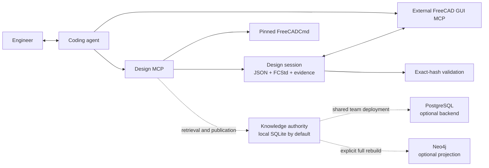

# Architecture and trust boundaries



The coding agent interprets requirements and prepares Design Lesson candidates.
The package validates structured operations, files, hashes, decisions, and
knowledge records. It does not call a language-model API.

## Design sessions

Each design owns one directory:

```text
designs/<design-id>/
├── design.json
├── model.FCStd
├── source/          # optional read-only source snapshot
├── validation/
├── output/
└── lesson-review/   # created only when material lessons exist
```

`DesignSession/v1` separates model status, direction approval, final
confirmation, and lesson review. Updates are atomic and lock-protected.

One direction approval authorizes CAD work and validation-driven correction
inside the agreed design. Final confirmation requires a completed FCStd whose
current SHA-256 matches the recorded model and passed validation report, plus
existing Markdown and PNG evidence.

A later FCStd byte change invalidates final confirmation and any pending lesson
review. Knowledge outages never invalidate an unchanged completed model.

## Knowledge

Knowledge retrieval is best effort. `completed_matches`,
`completed_no_match`, and `unavailable` are valid outcomes. Only an explicitly
required named source can make retrieval blocking.

### Backends

The knowledge authority has two interchangeable backends behind one repository
interface. An embedded SQLite database at `<workspace>/data/knowledge.sqlite3`
is the default and needs no running service. PostgreSQL is selected instead
whenever `MECH_DESIGN_DATABASE_URL` is set, and suits a shared team
deployment; `MECH_DESIGN_KNOWLEDGE_BACKEND` overrides the choice explicitly.

Both backends carry the same three tables, the same scoping, the same
canonical record shapes, and the same idempotent publication semantics, so a
design session behaves identically on either. Retrieval ranks exact normalized
terms ahead of text matching on both; SQLite matches every query token against
normalized token text where PostgreSQL uses its own full-text search.

The knowledge store contains exactly three durable business tables:

- `product_families` stores the scoped matching identity, profile, exact terms,
  and deterministic search text;
- `knowledge_assertions` stores scoped engineering facts, applicability,
  evidence, exact terms, and supersession state;
- `design_lessons` stores scoped reusable Lesson content, applicability,
  provenance, exact terms, and supersession state.

`knowledge_schema_migrations` is the only technical deployment table. Exact
normalized terms are checked after scoped B-tree filtering and before
expression-indexed PostgreSQL full-text search. Raw exact-term arrays are not
indexed because imported terms may exceed PostgreSQL's index-entry limit and
must remain complete for deterministic parity. The baseline does not require
pgvector.

It stores no design-session or CAD-edit state. A previous database layout is
not modified automatically; initialize a new knowledge database when the
bootstrap diagnostic requests it.

Neo4j is optional and contains only Agent-owned representations of those three
record types. An explicit rebuild replaces only nodes carrying the Agent's
projection-owner marker. Projection failure leaves knowledge retrieval and
`design_context_build` unchanged.

`mech-cad-design migrate` brings a workspace created by an earlier version up
to the current layout and applies the knowledge schema. It creates missing
managed directories and the local store, never touches existing design jobs,
and reports every planned action under `--dry-run` first.
`mech-cad-design knowledge import-postgres` copies one scope's durable
records from an existing PostgreSQL database into the local store, skipping
records already present so a repeated import is safe.

## Correction ledger

`design.json` carries an append-only `correction_ledger`. Each recorded result
adds one `DesignCorrectionLedger/v1` entry holding the attempt number, the model
SHA-256 it validated, the validation outcome, and every failed check with its
validator, identifier, message, and whether it was mandatory. Later attempts
append; they never edit or remove an earlier entry, so a corrected failure stays
readable after the model passes.

A session written before this release has no ledger. It loads normally and
reports an empty one, so existing design jobs keep working unchanged.

`design_mistakes` and `mech-cad-design design mistakes` summarize the ledger as
`DesignMistakeSummary/v1`: defects corrected before the confirmed model, and
defects still outstanding while the newest attempt fails. Corrections are
reported only while the newest attempt passes, so a currently failing design
never claims a fix.

## Design Lessons

Final-model confirmation immediately evaluates structured candidates derived
by the agent from the design history, model, validation evidence, corrections,
standard-part evidence, and manufacturing notes.

A candidate must identify a reusable problem, decision, evidence,
applicability, prevention action, and search terms. Private, customer-specific,
project-only, unsupported, or non-reusable candidates are excluded.

Candidates also come from the correction ledger itself. Every mandatory check
that failed on an earlier attempt and passed on the confirmed model yields one
deterministic candidate marked `origin: validation_correction`, carrying its
`validator::check_id` signature and attempt count. Agent-proposed candidates are
marked `origin: agent` and keep their positions on the card, so lesson selection
numbers stay stable. Derivation is pure, timestamp-free, and reproducible, so
repeating a confirmation yields a byte-identical review card. It cannot block
completion: a derived candidate that fails validation is dropped rather than
turned into a candidate error.

When nothing material remains, the design finishes. Otherwise the package
writes one immutable `DesignLessonReviewCard/v1` and returns it for display.
One subsequent natural-language decision publishes or declines the complete
card. Publication is idempotent by review-card SHA-256.

## FreeCAD and file safety

Existing source CAD is snapshotted read-only. Only the session `model.FCStd` is
edited. Before FreeCAD opens an FCStd, ZIP/XML inspection rejects encrypted,
ambiguous, oversized, path-unsafe, or scripted documents. FreeCADCmd must match
its configured file identity, version, and SHA-256 around every invocation.

Secure filesystem adapters cover atomic creation and replacement, path
containment, symlink or reparse-point rejection, exclusive locks, Unicode,
spaces, Windows path spelling, and cleanup of owned temporary data.

## Validation and standard parts

Completion requires machine-readable JSON, human-readable Markdown, and visual
PNG evidence for the exact FCStd hash. Assembly validation checks detected
fastener inventory, joint assignment, BOM coverage, connectivity, load paths,
motion clearance evidence, and external interfaces when applicable.

Standard components preserve provider, manufacturer, standard, part number,
nominal size, source URL, local path, validation report, metadata, and SHA-256.
The configured external catalog is checksum-addressed and remains separate
from generated design artifacts.

These checks provide evidence, not strength analysis, manufacturing release,
or safety certification.
